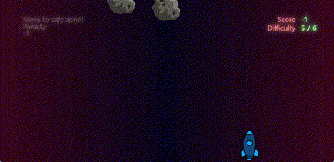

<p align="center">
  
</p>

Game for DirectX programming course (2D part). Nothing spectacular for sure but
I think it is quite cool for a game done in 3 days. It reminds me of old flash
games.

### Remarks for teacher

To create Visual Studio project, please run:

```
cmake . -B build
```

CMake should generate `build\Asteroids.vcxproj` and other files.

I'm sorry for the difficulties, I am using Windows ARM and I have no other
options apart from using CMake.

In case of any difficulties, I am eager to help. Thank you.
